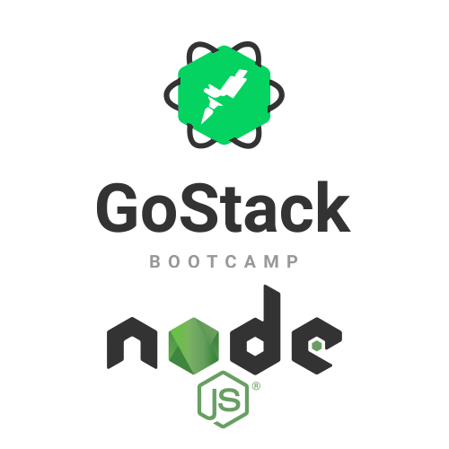

<h1 align="center">
  
</h1>

<h3 align="center">
  Desafio Bootcamp Rocketseat: Conceitos NodeJS, nesse desafio, foi criado uma aplicação para treinar o que aprendi até agora no Node.js!
  <br>
  Essa é uma aplicação para armazenar repositórios do meu portfólio, que irá permitir a criação, listagem, atualização e remoção dos repositórios, e além disso permitir que os repositórios possam receber "likes".
</h3>

<!-- <p align="center">See in action: <a href="#">click here</a></p> -->

<p align="center">
  

  

  <a href="https://github.com/lcoalves">
    
  </a>

  <a href="https://github.com/lcoalves/conceitos-nodejs/stargazers">
    
  </a>
</p>

## Getting Started

These instructions will get you a copy of the project up and running on your local machine for development and testing purposes. See deployment for notes on how to deploy the project on a live system.

### Prerequisites
- [NodeJS](https://nodejs.org/en/) - Environment runtime
- [Yarn](https://yarnpkg.com/getting-started/install) - Packager manager

What things you need to install the software and how to install them

```
$> git clone https://github.com/lcoalves/conceitos-nodejs.git
```

### Installing

A step by step series of examples that tell you how to get a development env running

#### Databases
First install back-end dependencies
```
$> cd conceitos-nodejs && yarn
```
Next open the code
```
$> code .
```

#### Back-end
Start back-end service
```
$> yarn dev
```

#### Back-end (Running TESTS)
First run
```
$> yarn test
```

## Test HTTP requests
Donwload Insomnia and import workspace from JSON
* [Insomnia](https://insomnia.rest/download/) - So you can finally GET some REST 😴
* [Insomnia Workspace](https://github.com/lcoalves/conceitos-nodejs/blob/master/.github/Insomnia_Bootcamp_Conceitos_Node.json) - Click to download


## Built With

* [Express](https://expressjs.com/pt-br/starter/installing.html) - Fast, unopinionated, minimalist web framework for Node.js
* [Jest](https://jestjs.io/docs/en/getting-started) - Jest is a delightful JavaScript Testing Framework with a focus on simplicity.

## Authors

* **Lucas Alves** - *Full Stack Developer* - [GitHub profile](https://github.com/lcoalves)

## License

This project is licensed under the MIT License - see the [LICENSE.md](https://github.com/lcoalves/conceitos-nodejs/blob/master/LICENSE) file for details

## Acknowledgments

* Express
* Jest
* ESLint
* Prettier
